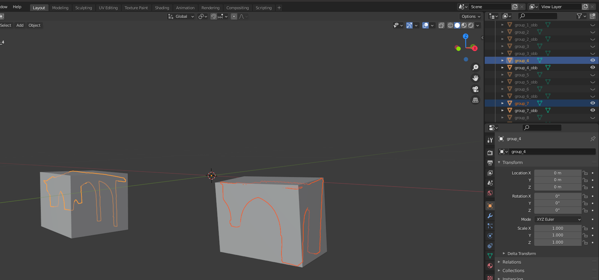
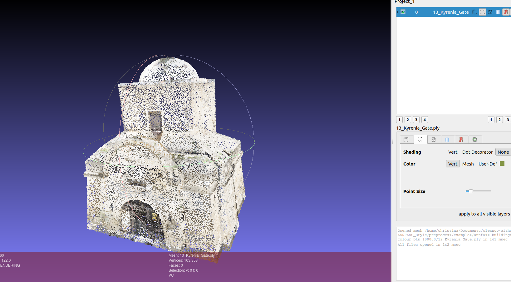
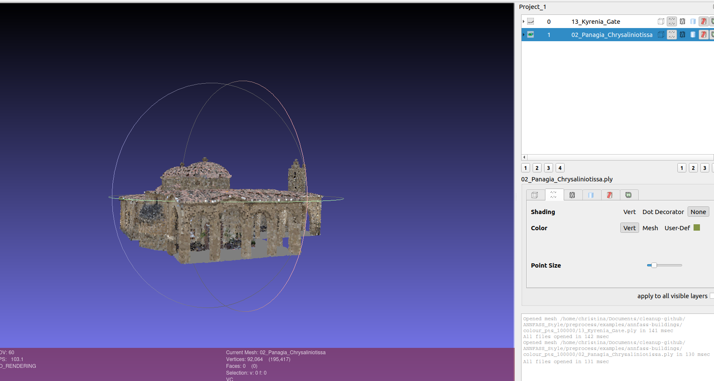

# style_detection

Work done related to 
[An artificial neural network framework for classifying the style of cypriot hybrid examples of built heritage in 3D](https://www.sciencedirect.com/science/article/abs/pii/S1296207423001395)
Some info regarding the data can be found in [An Artificial Neural Network Framework for Annotating and Classifying Architectural Structure and Style of Built Heritage in 3D](https://papers.ssrn.com/sol3/papers.cfm?abstract_id=4214310)

### Folder structure of this repo:
- 3d-AAE: can be found here: [3d_aae repo](https://github.com/christinazavou/3d-AAE/). It's about experiments with 3D input data.
- ae2D: experiments with 2D input data. Check Makefile to see what kind of commands I was running for the experiments.
- common: some common utilities. I didn't build it as a library in order not to have multiple library dependencies unesessary for each pipeline ...
- decorgan: experiments with 3D input data based on [DECOR-GAN](https://github.com/czq142857/DECOR-GAN).
- docs: documentation on the steps I took to generate different experiment pipelines.
- minkowski_based: experiments with 3D input data based on [MINKOWSKI-ENGINE](https://github.com/NVIDIA/MinkowskiEngine).
- preprocess: multiple preprocessing pipelines (check [preprocessing](#preprocessing)).
- resources:
  - splits: the splits that I used: 
    - pretraining on BUILDNET dataset
    - training and testing on ANNFASS dataset happened with 5 fold cross validation.
  - trained_models: the pickle file for each model to be used to extract encodings that are later used in SVM.
  - remaining: settings used for various purposes (e.g. for coloring the stylistic categories)
- scripts: scripts to install software, to run the preprocessing needed before inference, and to run the inference (these are used in production)
- splits: generating splits per method
- stats: generating statistics on the data
- svm: running the SVM tail (on the ANNFASS dataset) for different methods. also for inference in production

### Preprocessing

Note: some preprocessing documentation can be found here: https://quip.com/47KfAHGaqPpR/Pre-Processing-Procedure

#### Folder 'blender'
First install blender (e.g. use [this script](https://github.com/christinazavou/ANNFASS_Style/blob/master/scripts/install_blender.sh)) 

Here are some commands to preprocess the examples given:

##### Triangulate the mesh faces:
```make triangulate-annfass ROOT_DIR=~/Documents/cleanup-github/ANNFASS_Style/preprocess/examples ANNFASS_REPO=annfass-buildings RAW_DIR=raw BLENDER_EXE=/home/christina/Downloads/blender-2.91.0-linux64/blender BUILDING_FILE= /home/christina/Documents/ANNFASS_Style/preprocess/examples/annfass-buildings/buildings_with_style```

#### Group the mesh faces with adhoc algorithm into building elements, and for each group generate one oriented bounding box:
```
conda create -n preprocess python=3.9 && conda activate preprocess
pip install plyfile scipy pillow psd-tools
chmod +x /home/christina/Documents/ANNFASS_Style/preprocess/oriented_bounding_box/cgal_impl/cmake-build-release/OrientedBboxC
make normalize-annfass PY_EXE=/home/christina/software-installed/miniconda3/envs/preprocess/bin/python ROOT_DIR=~/Documents/cleanup-github/ANNFASS_Style/preprocess/examples ANNFASS_REPO=annfass-buildings BUILDING_FILE=~/Documents/cleanup-github/ANNFASS_Style/preprocess/examples/annfass-buildings/buildings_with_style
```
See two of the groups created for building '02_Panagia_Chrysalinitotissa' with their oriented bounding boxes below:


#### Create a point cloud for each building from its mesh:
Note: this is using a private repo (shapefeatureexporter is written from Dr. Evangelos Kalogerakis and his team at UMASS. You need to request access from him to use it.)
```
pip install open3d
cd point_cloud_generation
python create_point_cloud.py --sfe ../mesh_sampling/shapefeatureexporter/build/ShapeFeatureExporter --model_id 02_Panagia_Chrysaliniotissa --model_filename ../examples/annfass-buildings/normalizedObj/02_Panagia_Chrysaliniotissa/02_Panagia_Chrysaliniotissa.obj --pts_dir ../examples/annfass-buildings/samplePoints/point_cloud_100K --face_dir ../examples/annfass-buildings/samplePointss/faces_100K --num_samples 100000
python create_point_cloud.py --sfe ../mesh_sampling/shapefeatureexporter/build/ShapeFeatureExporter --model_id 13_Kyrenia_Gate --model_filename ../examples/annfass-buildings/normalizedObj/13_Kyrenia_Gate/13_Kyrenia_Gate.obj --pts_dir ../examples/annfass-buildings/samplePoints/point_cloud_100K --face_dir ../examples/annfass-buildings/samplePoints/faces_100K --num_samples 100000
```

#### Convert point cloud to .ply format (to be able to see it in blender etc.) for each building component (grouped mesh):
Note: in order to run correctly the name of directories need to follow the format samplePoints/point_cloud_ and samplePoints/faces_
```
cd point_cloud_generation
python pts2plys.py --pts_dir ~/Documents/cleanup-github/ANNFASS_Style/preprocess/examples/annfass-buildings/samplePoints/point_cloud_100K --ply_dir_prefix ply --buildings_csv /home/christina/Documents/ANNFASS_Style/preprocess/examples/annfass-buildings/buildings_with_style.csv --cut_at 10000 --num_processes 2 --per_component False --groups_dir ~/Documents/cleanup-github/ANNFASS_Style/preprocess/examples/annfass-buildings/groups --obj_dir ~/Documents/cleanup-github/ANNFASS_Style/preprocess/examples/annfass-buildings/normalizedObj --ply_dir_prefix ~/Documents/cleanup-github/ANNFASS_Style/preprocess/examples/annfass-buildings/samplePoints/ply
```
or (to parallelize when many buildings)
```
cd scripts/local
make pts2ply_with_group PY_EXE=/home/christina/software-installed/miniconda3/envs/preprocess/bin/python REPO=annfass-examples ROOT_DIR=~/Documents/cleanup-github/ANNFASS_Style/preprocess/examples  STYLE_REPO=~/Documents/cleanup-github/ANNFASS_Style BUILDING_FILE=~/Documents/cleanup-github/ANNFASS_Style/preprocess/examples/annfass-buildings/buildings_with_style END_IDX=2 CUT_AT=10000 OBJ_DIR=~/Documents/cleanup-github/ANNFASS_Style/preprocess/examples/annfass-buildings/normalizedObj SAMPLES_PTS_DIR=~/Documents/cleanup-github/ANNFASS_Style/preprocess/examples/annfass-buildings/samplePoints/point_cloud_100K GROUPS_DIR=~/Documents/cleanup-github/ANNFASS_Style/preprocess/examples/annfass-buildings/groups PLY_DIR_PREFIX=~/Documents/cleanup-github/ANNFASS_Style/preprocess/examples/annfass-buildings/samplePoints/plyAgain
```

#### Find unique building components (in order not to render the same component more than once & in order to balance the dataset: duplicates should be removed!):
```
cd scripts/local
pip install torch torchvision torchaudio
make find-unique-components PY_EXE=/home/christina/software-installed/miniconda3/envs/preprocess/bin/python REPO=annfass-examples ROOT_DIR=~/Documents/cleanup-github/ANNFASS_Style/preprocess/examples  STYLE_REPO=~/Documents/cleanup-github/ANNFASS_Style BUILDING_FILE=~/Documents/cleanup-github/ANNFASS_Style/preprocess/examples/annfass-buildings/buildings_with_style END_IDX=2 CUT_AT=10000 PLY_DIR_PREFIX=~/Documents/cleanup-github/ANNFASS_Style/preprocess/examples/annfass-buildings/samplePoints/plyAgain
```


#### Colorize the generated point cloud of each building:
```
cd colour_point_cloud
python main.py --objects_dir ../examples/annfass-buildings/normalizedObj --points_dir ../examples/annfass-buildings/samplePoints/point_cloud_100K --faces_dir ../examples/annfass-buildings/samplePoints/faces_100K --buildings_csv ../examples/annfass-buildings/buildings_with_style.csv --output_dir ../examples/annfass-buildings/colour_ply_100K
```
Example results below:




#### Generate viewpoints for each building and each (grouped) component (to be used later to render the components in Blender):

```
make viewpoints REPO=annfass-examples ROOT_DIR=~/Documents/cleanup-github/ANNFASS_Style/preprocess/examples  BLENDER_EXE=/home/christina/Downloads/blender-2.91.0-linux64/blender STYLE_REPO=~/Documents/cleanup-github/ANNFASS_Style BUILDING_FILE=~/Documents/cleanup-github/ANNFASS_Style/preprocess/examples/annfass-buildings/buildings_with_style
```

-MODE=1 -BUILDINGS_CSV  -LOGS_DIR 

#### google_drive
After creating the groups for example you can upload them in google drive:
```
cd google_drive
pip install google-api-python-client google-auth-oauthlib
python upload_groups.py --root_dir=~/Documents/cleanup-github/ANNFASS_Style/preprocess/examples/annfass-buildings --gdrepo=examples-annfass-groups --groups_path=groups --buildings_csv=~/Documents/cleanup-github/ANNFASS_Style/preprocess/examples/annfass-buildings/buildings_with_style.csv
```


**Debugging**: if you want to debug pytorch code, that uses DataLoader in pycharm: then as described [here](https://stackoverflow.com/questions/39371676/debugger-times-out-at-collecting-data/51833034#51833034) you need to go to settings -> python debugger -> enable gevent compatible; otherwise, debug will hang on for forever

